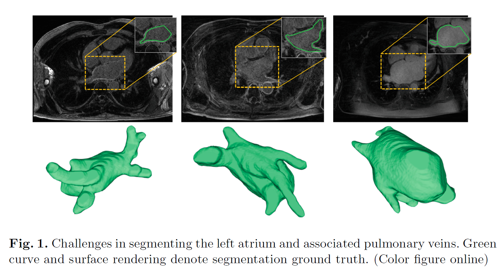

# Left_Atrium_Segmentation

https://link.springer.com/chapter/10.1007/978-3-030-12029-0_26

### Abstract 
准确的左心房分割，有助于帮助诊断心脏相关疾病，传统的左心房分割依赖于专家的人工。我们提出了使用深度神经网络进行3D的GE-MR图像中左心房的自动分割。

#### 挑战：

1 左心房与背景相比，占图像中很小的比例，使得算法难以定位和识别边界细节。

2 由于与周围的组织有相似的亮度，以及由于有限的MR清晰度导致的心肌壁较薄，心房和肺部血管周围的边界通常出现歧义和界限模糊。

3 左心房的尺寸和形状会随着个体和观测时间点的不同而不同。

4 肺部血管的拓扑形状，尤其是数量，呈现出较弱的模式。

#### 本文工作：

1 提出一种基于深度神经网络的对GE-MR图像自动左心房分割的解决方案。

2 发现在这个任务中，2D的架构在速度和准确性方面能轻松超越3D架构。

3 考虑到左心房有高度分化各异的形态和连着肺部血管的分支结构， 提出采用**一个特征金字塔结构**去从多尺度特征图中收集语义信息，以获得更好的分割效果

4 提出了**Online Hard Negative Example Mining 在线困难负样本挖掘**策略去困难样本的分割，并且惩罚错误的预测。

5 设计了我们设计了一种**Competitive Training Scheme竞争性训练体系**去进一步提升网络的性能和泛化能力。

#### 最终结果：

在Atrial Segmentation Challenge dataset in STACOM 2018 的 20个测试Volume上，我们提出的框架获得了92.83%的Dice指标，比赛排名第二。

### Method
模型采用带Dilated的ResNet抽取层次化的特征，,用特征金字塔产生多尺度的特征图，concat起来，经过Dropout后送到last conv层进行最终预测得到结果。

#### OHNEM:

1 确定要选择的困难负样本数目  Chn = max(2 * Cp, min(5, Cn/4)) , 其中 Cp和Cn是从label中计算的前景像素点数目和背景像素点数目

2 所有背景像素根据得分降序排列

3 最后loss 仅仅计算 top Chn个背景样本点的loss 和 所有前景样本点的loss。

#### Competitive Training Scheme (CTS3)

1 采用相同的初始配置，同时训练多个同一模型，成为多个竞争者模型

2 在验证的轮次，挑选出所有模型中竞争者验证loss最低的模型作为winner，将其参数广播，对其他模型进行重新初始化。

3 然后所有的竞争者模型继续finetune，直到下一个验证轮次产生下一个winner。

4 重复step2,step3直到结束训练

在训练的过程中，所有的竞争者都面临越来越强烈的竞争。所有的竞争者都被局部最优模型提升了。为了更有效的梯度下降，他们只能去挖掘更有信息量的样本，这反过来也促进了所有竞争者的性能。
不同于大量使用多个网络ensemble， 我们的模型在测试阶段只保留winner进行测试。

PSPNetD = PSPNet + dilated convolution and dropout
**最终模型**是 PSPNetD + OHNEM + CTS3

**分割效果可视化** 

可视化结果说明我们的方法能很好地处理形状和尺寸的变化。
分割结果表面的大多数点都呈现了相对Ground Truth较低的Hausdorff距离（即图中冷色调表示较低的距离）

